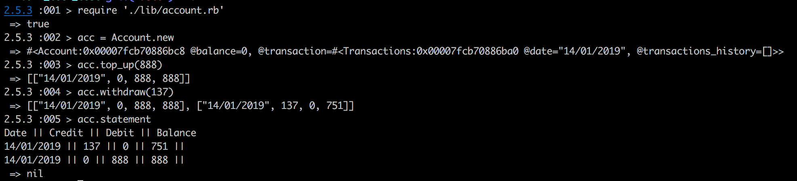

# Bank tech_test

IRB app which displays account total, allows to withdraw and deposit money, displays statement.

## MVP User Stories

```
As a user,
So I can manage my money
I have an account.

As a user,
So I can use my account,
I can top up my account.

As a user,
So I can use my account,
I can withdraw money from my account.

As a user,
So I can keep track of my funds,
I can view statement in this format:
date || credit || debit || balance
14/01/2012 || || 500.00 || 2500.00
13/01/2012 || 2000.00 || || 3000.00
10/01/2012 || 1000.00 || || 1000.00

```

### Set up project

- Clone the repo
- and then run:

```
$ bundle install
```

### To run tests:

```
rspec
```


### To run the app in IRB:

* Open `irb` and run `require './lib/account.rb'`
*  Follow the instructions below:
```
acc = Account.new
=> creates a new account instance

acc.top_up(888)
 => add money to account

acc.withdraw(137)
 => deduct money from account

acc.statement
Date || Credit || Debit || Balance
14/01/2019 || 137 || 0 || 751 ||
14/01/2019 || 0 || 888 || 888 ||
```

## Screenshot


